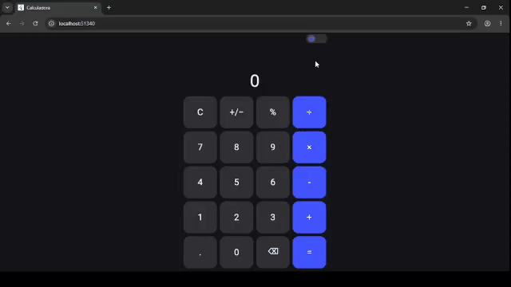
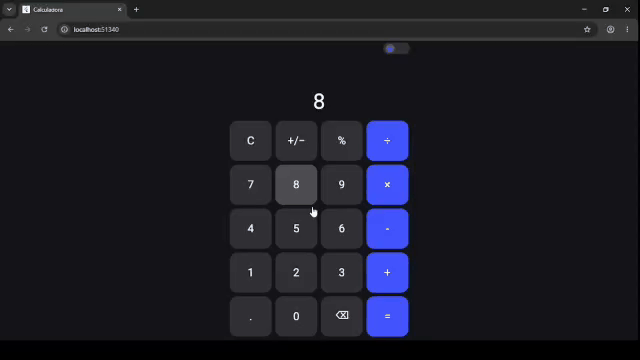

# Calculadora Flutter

Projeto de uma calculadora desenvolvida em Flutter.

## Código principal

O código principal da calculadora está localizado em:

`lib/main.dart`

## Funcionalidades

- Operações matemáticas básicas
- Adição
- Subtração
- Multiplicação
- Divisão
- Porcentagem
- Alteração de sinal
- Botão de limpar
- Botão de apagar
- Modo claro
- Modo escuro
- Interface responsiva

## Demonstração

### Modo claro

### Modo escuro

